# C64 Ultimate Control Panel

A comprehensive web-based control panel and toolset for the Commodore 64 Ultimate (C64U) devices, providing remote access to system management, configuration, drive control, and more through your browser on any device.

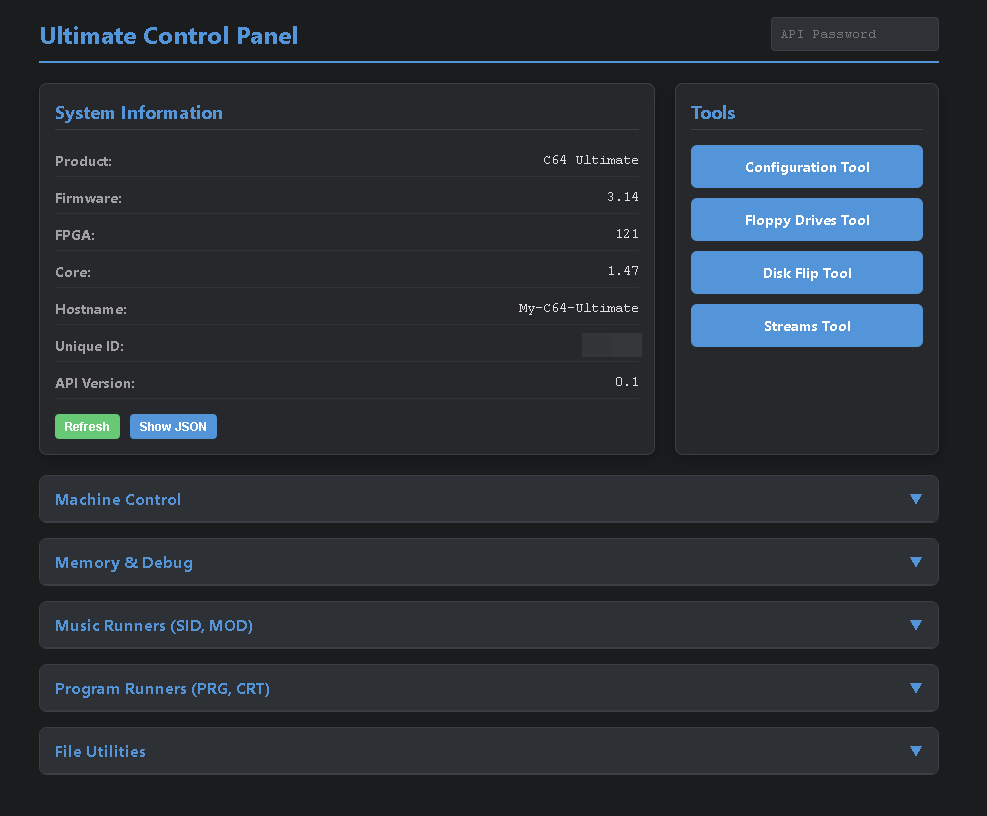

## Features

- **Unified Control Panel** - Central hub for all system operations and API functions
- **Configuration Tool** - Browse and modify all device settings
- **Floppy Drives Tool** - Manage virtual floppy drives, mount disk images, and perform drive operations
- **Disk Flip Tool** - Quick disk image flipping for multi-disk games
- **Data Streams Tool** - Configure and control data streaming to external devices

## Repository Structure

```
├── html/          # Main tool files (copy to /Flash/html on your C64U)
└── pics/          # Screenshots and images for documentation
```

## Setup Instructions

### Prerequisites

- Commodore 64 Ultimate device (Ultimate 64, Ultimate II+, etc.)
- Local network connection (WiFi or Ethernet)
- FTP client or file explorer with FTP support (Windows File Explorer works fine)
- Web browser (Chrome, Firefox, Edge, Safari, etc.)

### Configuration Steps

#### 1. Configure Network on C64U

Ensure your C64U is connected to your local network and has an assigned IP address.

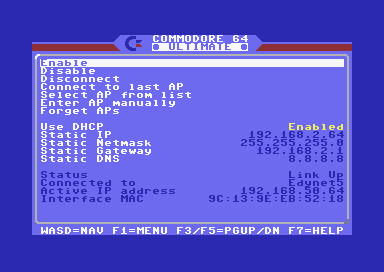
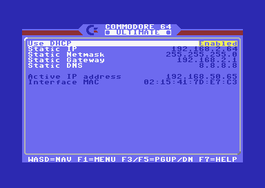

**Note down the Active IP address** - you'll need it for the next steps.

#### 2. Enable Network Services

Navigate to **Network Services & Timezone** in the C64U menu and enable:
- **FTP File Service**
- **Web Remote Control Service**

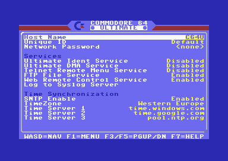

#### 3. Download the Repository

Clone or download this repository to your local computer, or download as ZIP and extract to a local folder.

#### 4. Connect via FTP

Open your file explorer and enter the following path in the address bar:

```
ftp://<c64u_ip>
```

Replace `<c64u_ip>` with the IP address noted in step 1.

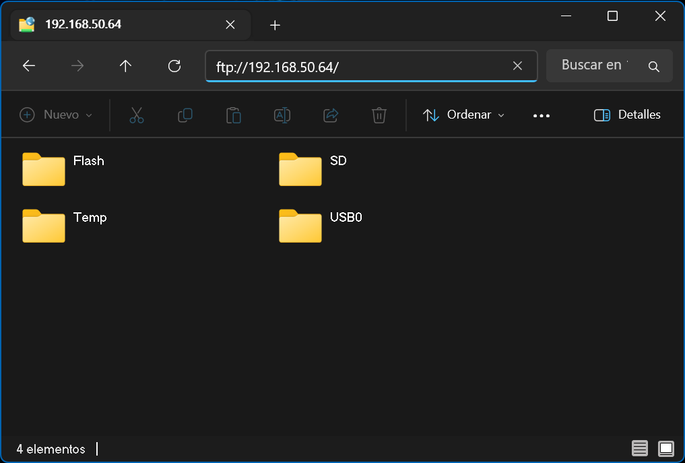

This will show the internal storage devices of your C64U.

#### 5. Copy Files to C64U

1. Navigate to the **/Flash/html** folder on your C64U
2. Backup or rename the original **index.html** file
2. Copy all files from the **html** folder in this repository to **/Flash/html** on your C64U

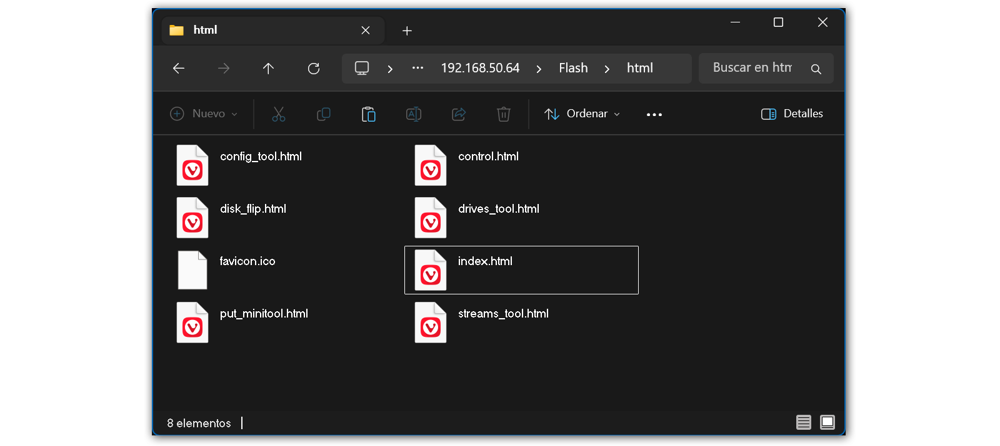

#### 6. Access the Control Panel

Open your web browser and navigate to:

```
http://<c64u_ip>
```

## Ultimate Control Panel

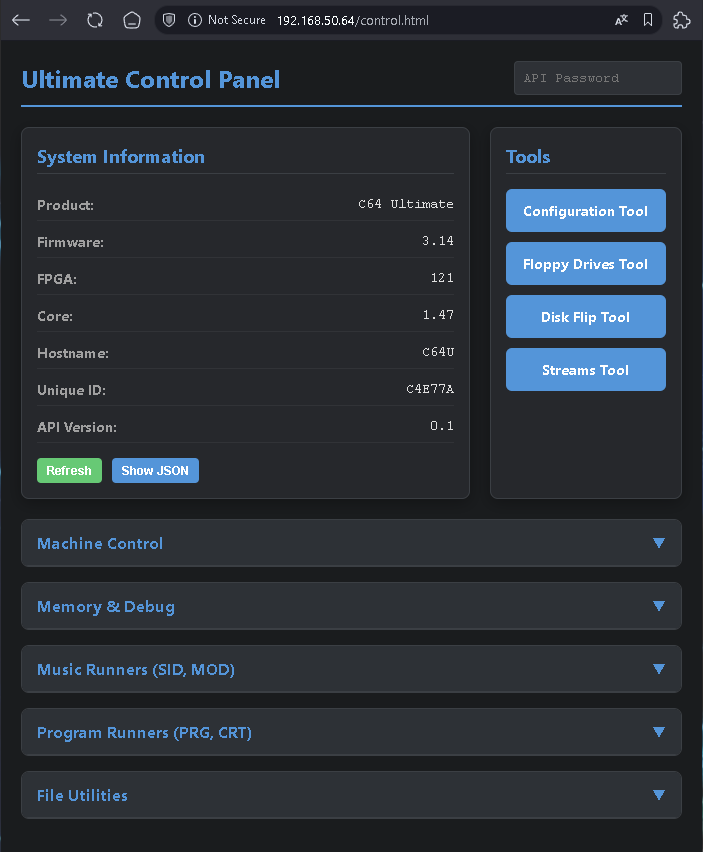

The Control Panel serves as the central hub for all system operations and provides direct access to the C64U's REST API. It features a clean, organized interface divided into functional sections and tools.

### System Information

Displays essential device information. The **Refresh** button updates all information, while **Show JSON** reveals the raw API response for debugging purposes.

### Tools

Quick navigation buttons to access specialized tools:
- **Configuration Tool** - System settings management
- **Floppy Drives Tool** - Virtual drive control
- **Disk Flip Tool** - Multi-disk image management
- **Streams Tool** - Data streaming configuration

### Machine Control

Power management and system control functions including power off, reset (soft and hard), reboot, and C64 mode switching.

### Memory & Debug

Advanced memory operations for developers and power users. Useful for debugging, development, and low-level system interaction.

### Media Players

Built-in media playback capabilities for SID music files and Amiga MOD tracker files. Upload files directly from your computer or specify paths to files stored on the C64U's storage devices.

### Program Runners

Load and execute Commodore 64 programs and cartridges. Supports PRG (program) and CRT (cartridge) formats. Files can be uploaded directly through the browser or loaded from storage paths.

### File Utilities

File system operations and disk image management:
- **Get File Info** - Retrieve detailed information about any file (size, type, attributes)
- **Create D64** - Generate new blank D64 disk images with configurable track count (35 or 40) and optional disk name

### API Password

If your C64U has an API password set, enter it in this field. Otherwise, leave it empty.

## Configuration Tool

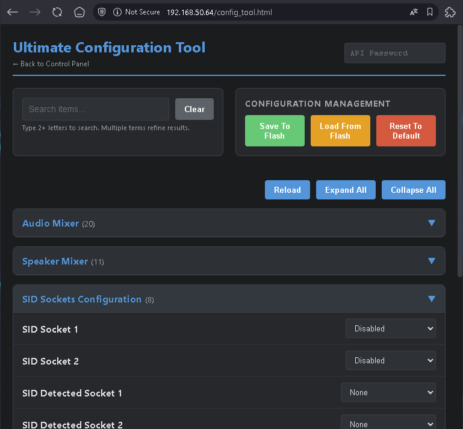

A comprehensive interface for browsing and modifying all device settings. It organizes all configuration options exposed by the C64 Ultimate, making it easy to find and adjust specific settings.

The powerful search feature filters the options matching the specified terms, allowing you to quickly find any of the C64U configuration options.

Each setting displays its current value and can be modified individually. Changes are sent to the C64U and take effect immediately.

### Operations

- **Save to Flash** - Write the current settings to the C64U flash memory. Use this to make any changes persistent.
- **Load from Flash** - Retrieve the current configuration stored in the C64U flash memory (it might not be the currently active configuration).
- **Reset to Default** - Reset the configuration to the factory default settings. This does NOT clear or modify the values stored in the C64U flash memory.
- **Reload** - Reload the current configuration from the device.

## Floppy Drives Tool

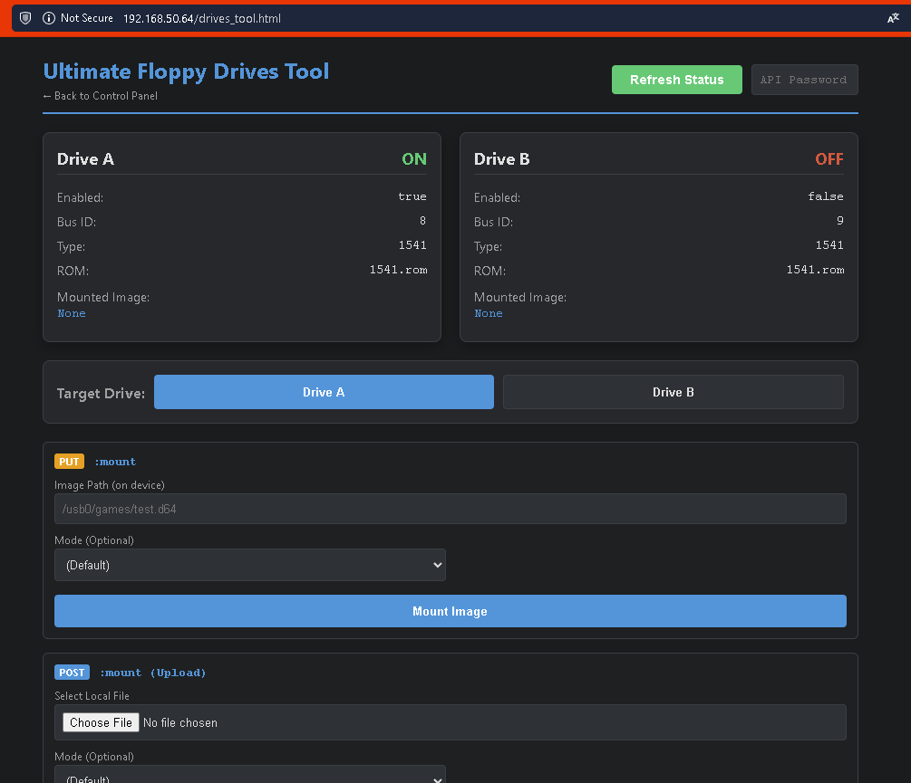

Provides complete control over the C64U's two virtual floppy drives (A, B). Each drive maintains its own state and can have different disk images mounted simultaneously.

A selector toggles the target drive between A and B for the available operations.

### Drive Operations

- **Mount Image** - Load a D64, D71, D81, or G64 disk image from a file path. **Upload & Mount** uploads a disk image from your computer and mounts it immediately.
- **Load ROM** - Loads a drive ROM into the selected drive from a file path. The size of the ROM file needs to be 16K or 32K, depending on the drive type. Loading the ROM is a temporary action; setting the drive type or rebooting the machine will load the default ROM. **Upload & Load ROM** uploads a ROM file from your computer and loads it into the drive immediately.
- **Set Mode** - Change the drive mode in the selected drive. Available modes are 1541, 1571, and 1581. Changing the mode also loads the drive ROM.
- **Remove Disk** - Remove the mounted disk from the drive.
- **Reset Drive** - Perform a reset on the drive.
- **Turn ON / Turn OFF** - Enable or disable the selected drive.

## Disk Flip Tool

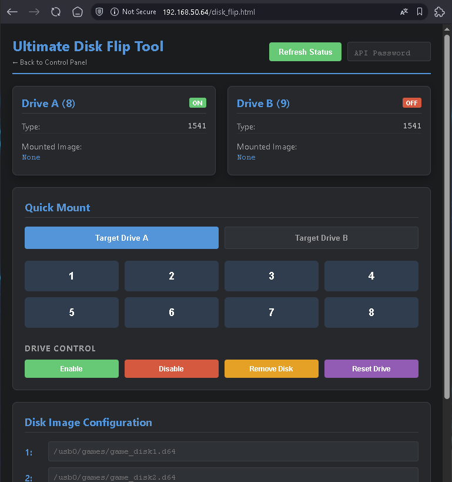

A handy tool designed specifically for managing multi-disk games and applications. It provides a streamlined interface for quickly switching between disk images.

### Quick Mount

1. Enter the file paths for each disk in your set (e.g., `/usb0/games/game_disk1.d64`, `/usb0/games/game_disk2.d64`)
2. Select the target drive (default A)
3. Click the disk buttons **1**, **2**, **3**, etc to mount the corresponding disks immediately

The file paths are saved persistently in the browser's local storage.

The **Drive Control** buttons provide additional quick drive operations (Remove Disk, Enable, Disable, Reset).

### Saved Configurations

Enter a configuration name for the current file list to be saved under the given name. This allows having different flip disk configurations for different games (similarly to the FLIPDISK files for the Vice emulator).

The configurations are saved to the browser's local storage.

## Data Streams Tool

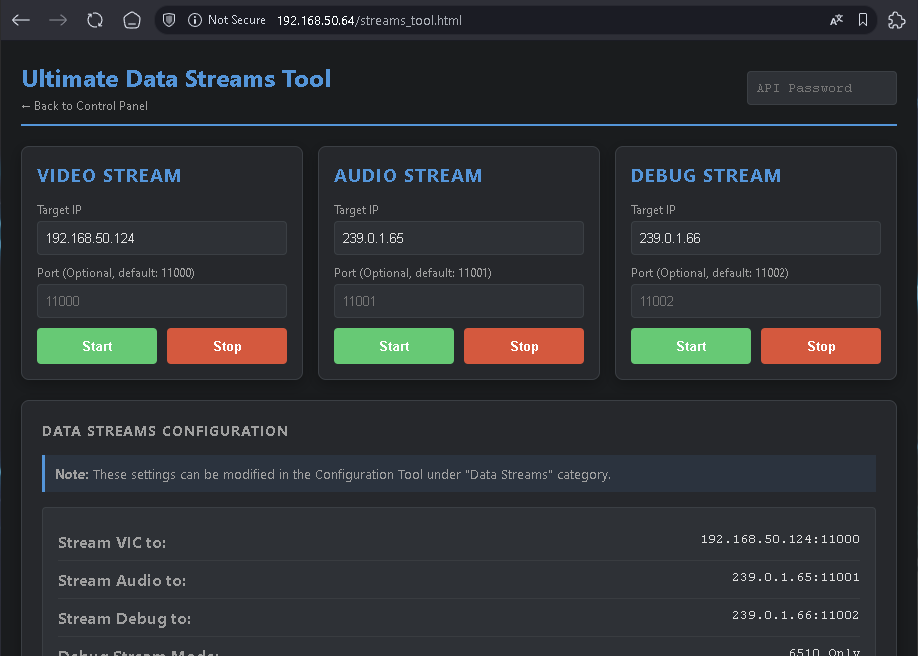

Manages the C64U's data streaming capabilities, which allow real-time transmission of video, audio, and debug data to external devices over the network.

For each stream, configure:

- **Target IP** - Destination IP address for the stream data
- **Target Port** - Destination port number (optional, uses device defaults if empty)
- **Start/Stop** - Turn the stream on or off

### Data Streams Configuration

This section shows the streaming settings currently configured in the C64U. These may be modified in the Configuration Tool under the "Data Streams" category.

Any empty Target IP fields in the Stream sections are automatically populated with these settings when the page loads or the Refresh button is clicked. Both Target IP and Port values are saved to the browser's local storage.

## Troubleshooting

### Cannot Connect to C64U

- Verify the C64U is powered on and connected to the network
- Check that the IP address is correct
- Ensure "Web Remote Control Service" is enabled in Network Services
- Try pinging the C64U IP address to verify network connectivity

### FTP Connection Fails

- Verify "FTP File Service" is enabled in Network Services
- Check firewall settings on your computer
- Try using a dedicated FTP client (FileZilla, WinSCP, etc.)

### Tools Not Loading

- Reload the page bypassing the cache (typically Ctrl+F5)
- Check browser console for JavaScript errors (F12 → Console tab)
- Verify all files were copied correctly to /Flash/html

### API Operations Fail

- Ensure the API password is correct (if set)
- Check that the device is not busy with other operations
- Try refreshing the page and attempting the operation again

## Development

These tools are built with vanilla HTML, CSS, and JavaScript with jQuery for AJAX operations. No build process or dependencies are required.

To modify or extend the tools:

1. Edit the HTML files directly
2. Test changes by copying updated files to your C64U
3. Refresh your browser to see changes

All tools use the C64U REST API documented in the [official Ultimate firmware documentation](https://1541u-documentation.readthedocs.io/en/latest/api/api_calls.html).

## License

This project is open source and available under the MIT License.

## Credits

Developed by Angel "Edy" Garcia for the Commodore 64 Ultimate community. Special thanks to Gideon Zweijtzer, Peri Fractic and the [Commodore](http://www.commodore.net) team for creating this amazing piece of technology and providing such a comprehensive REST API.

## Contributing

Contributions are welcome! Please feel free to submit issues, feature requests, or pull requests.

---

**Enjoy your Commodore 64 Ultimate Control Panel!** 🎮
